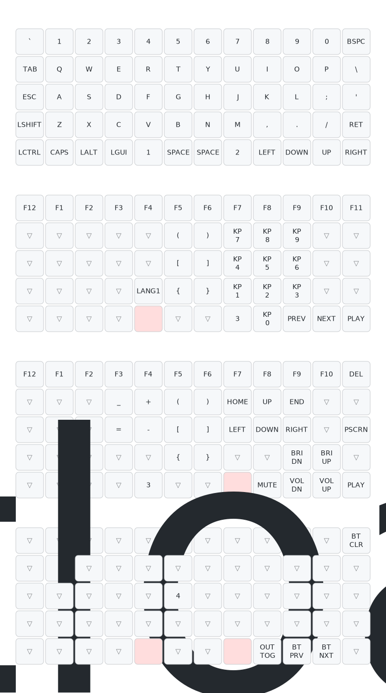

# 5x12

Firmware for handwired keyboard with Bluetooth connectivity inspired by Preonic (OLKB) by Jack Humbert.

To change the keymap, modify the `5x12.keymap` file within `5x12-zmk-config/boards/arm/5x12`. Check out the [ZMK docs](https://zmk.dev/docs/codes) for a full list of codes/behavior that can be set.

Fork this repository and on every push, Github Actions will create a new firmware. The `firmware.uf2` file should be dragged and dropped when they keyboard is in `BOOTLOADER` state.

The default layout image can be found within the repository. There is a `BOOTLOADER` key in layer 3 that puts the keyboard into a flashable state for a new firmware. If this key is not found, the only way to flash the keyboard is to use the physical buttons on the MCU - to access the MCU, the screw on the back of the keyboard needs to be removed.

